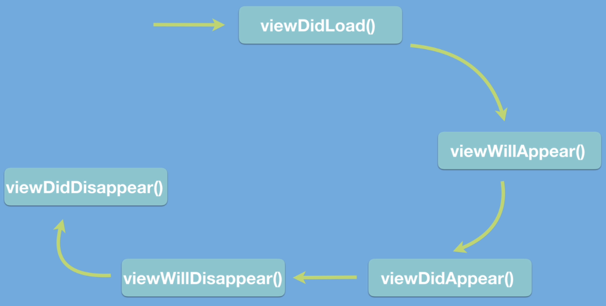

# LifecycleDemo-198-Section-15

## Lifecycle

## viewDidLoad
 
method is only called once when the view is created

## viewWillAppear
 
viewWillAppear is called just before the view actually shows up on the screen. A good time point for us to be able to hide or show certain UI components like what we did in our FlashChat app when we hid the navigation

## viewDidAppear

if you tap into this method, then the view is already on screen and the user is already able to see the ViewController. So this is a good time point to, for example, start a countdown timer if you were going to do that on the screen or start an animation,

## viewWillDisappear

if they navigate it back or if they somehow dismissed this current ViewController, then this is the first method that's going to be called to allow you to write some code to prepare for this event. So, for example, you probably want to stop your animations and you might want to change the appearance of UI

## viewDidDisappear

at this point, the view is already off the screen and this is, basically, the last moment where we get to change anything about that previous view before it disappears off the screen. Now, just because the view has disappeared, it doesn't mean that it has been deallocated or has been deleted from the memory of the phone.

